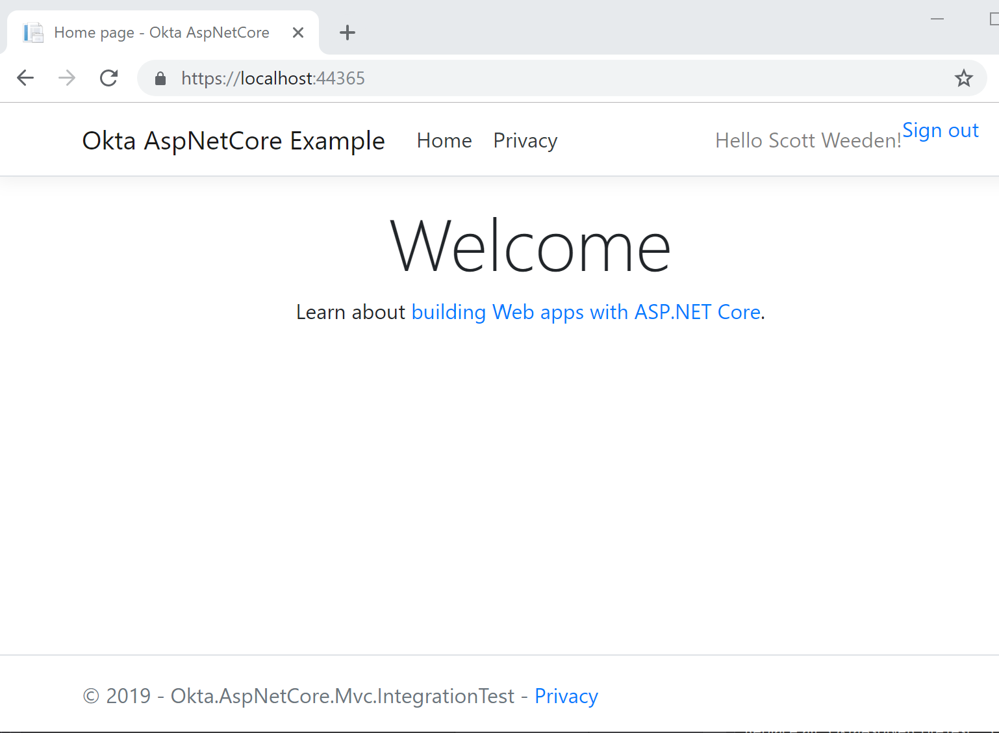
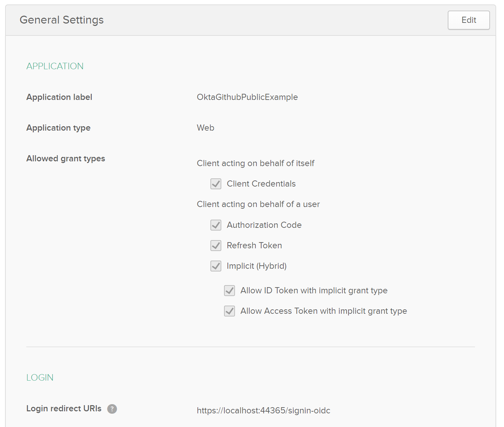
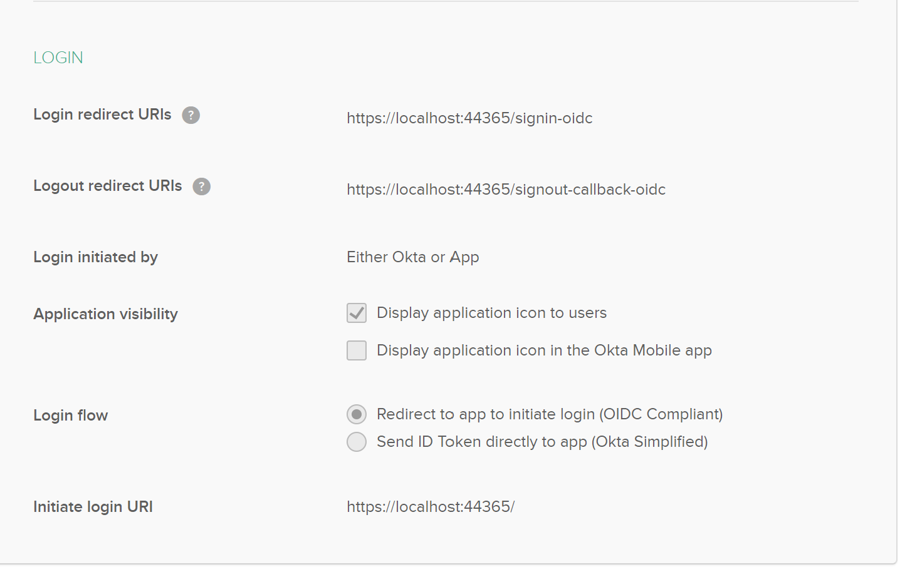
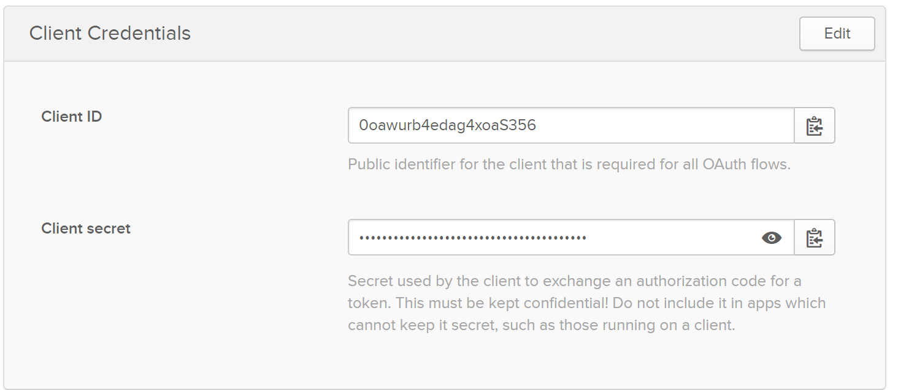
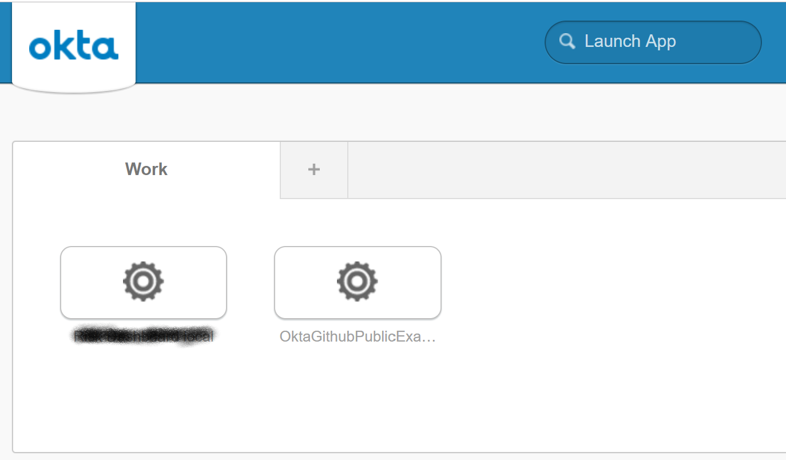

# Open ID example project for AspNetCore 2.2 using ( O365 -or- Okta )

The code examples in this project is availble under the GNU public license and is provided for informational purposes.

The client ID and secret provided in the app settings json file are for development examples only and will not work out of the box. You should sign up for an Okta developer account or Office 365 developer account if you are outside the Jabil organization.

## Web App

## Okta Admin Settings

## Okta Dashboard 

